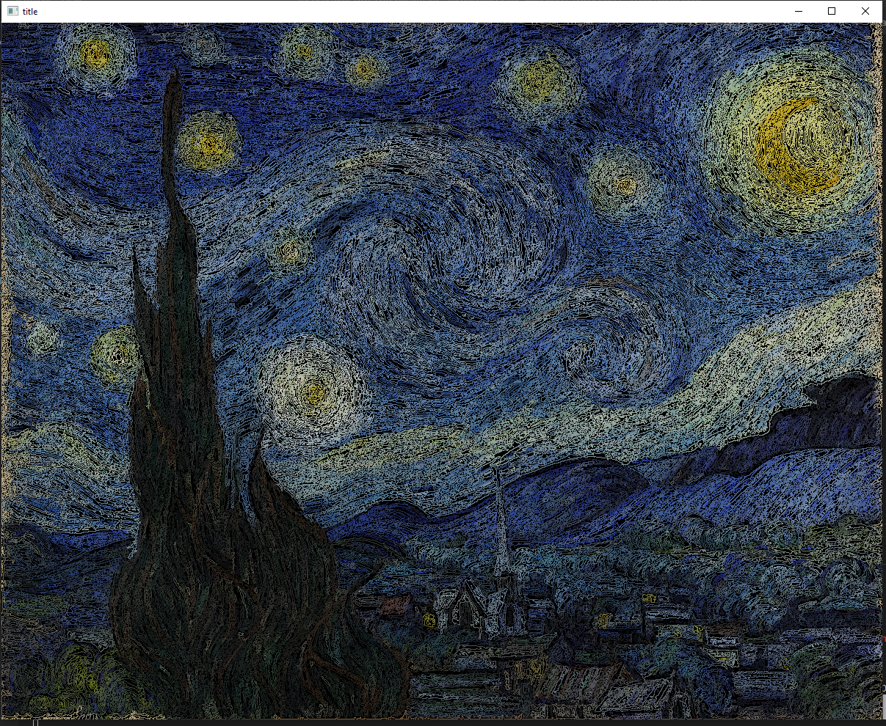
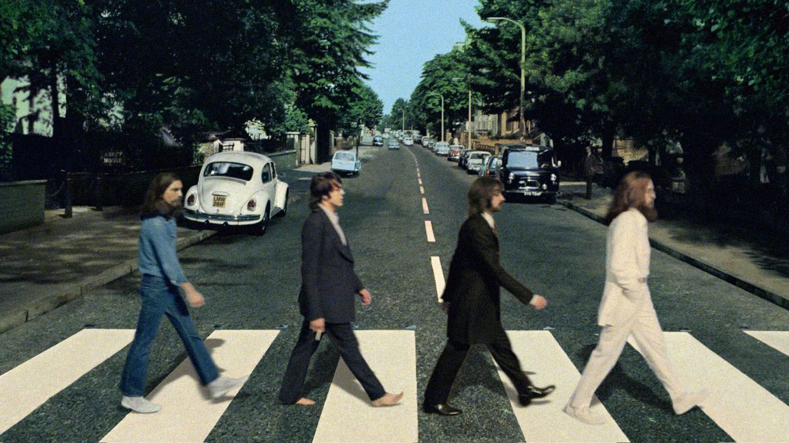
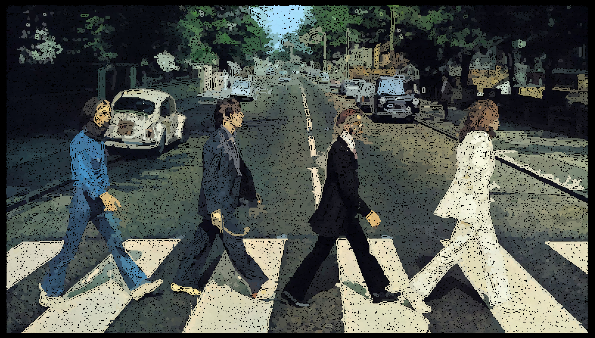

# breakingTurtleGraphics

## Description

breakingTurtleGraphics is a Python program that takes an image and converts it into a list of lines, with a color included, and draws them using Python turtle graphics. In this project, we used two images, Starry Night by Van Gogh and Abbey Road album cover by The Beatles. You can find these images in the example folder.

After running the program, you will get a new image, which is a visual representation of the lines from the original image. You can find the resulting images in the output_images folder.

## Installation


To use BreakingTurtleGraphics, you will need to have Python 3 installed on your computer. You can download Python 3 from the official [website](https://www.python.org/downloads/).

Clone this repository to your local machine using the following command:


```
git clone https://github.com/your-username/breakingTurtleGraphics.git
```

Install the necessary packages using 

```
pip install -r requirements.txt.
```

Navigate to the breakingTurtleGraphics directory.

Put your own image in the base_images folder.

Run the program with the following command:

```
python main.py
```

## Example

Original Image: Starry Night by Van Gogh


Resulting Image: Starry Night by Van Gogh with lines drawn using turtle graphics



Original Image: Abbey Road album cover by The Beatles



Resulting Image: Abbey Road album cover by The Beatles with lines drawn using turtle graphics



## Credits

This project was created by **happihound**. The original images used in this project are Starry Night by Van Gogh and Abbey Road album cover by The Beatles.